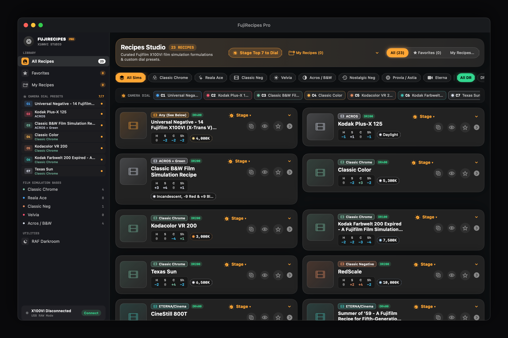
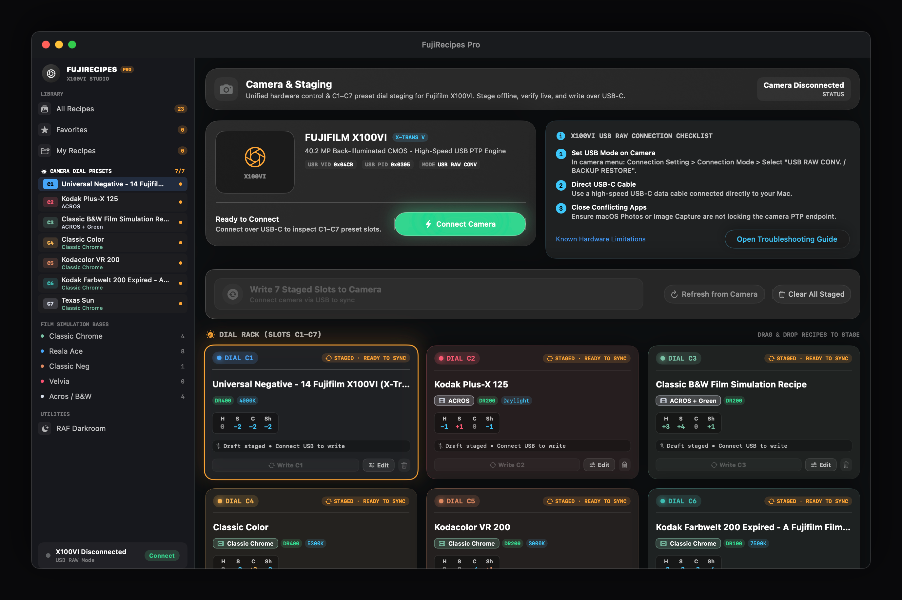
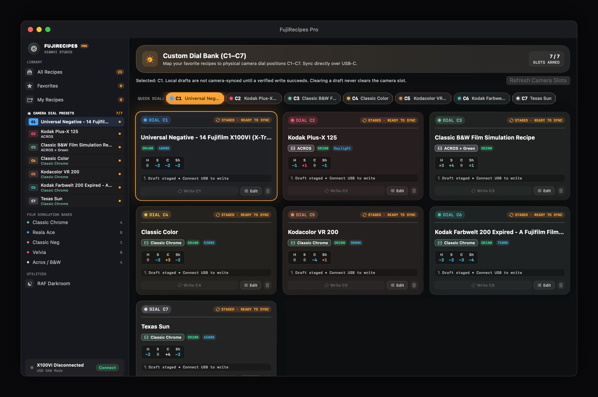
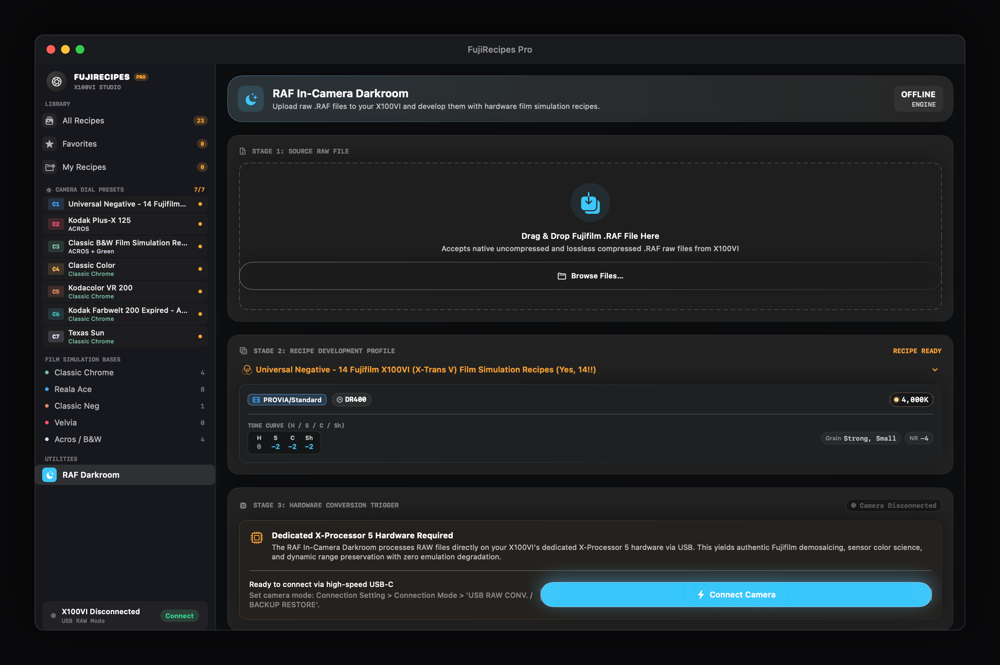
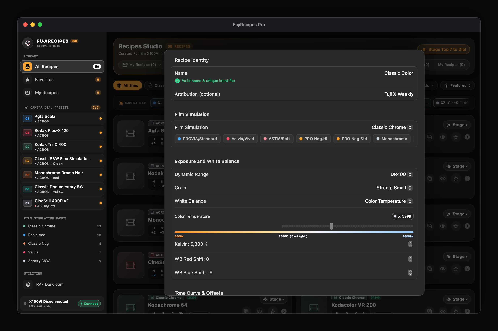

<div align="center">

# FujiRecipes for macOS

### A native macOS recipe studio with an X100VI C1–C7 camera workflow.

[-000000?style=for-the-badge&logo=apple&logoColor=white)](https://apple.com/macos)
[](https://swift.org)
[](https://developer.apple.com/xcode/)
[](https://fujifilm-x.com/products/cameras/x100vi/)
[](https://fujifilm-x.com)
[](docs/camera-connection-guide.md)
[](LICENSE)
[](https://github.com/AntApper/FujiRecipesMac/actions/workflows/macos-ci.yml)

<br/>

<p align="center">
  
</p>

</div>

---

## Overview

**FujiRecipes for macOS** is a high-performance, native macOS desktop companion engineered specifically for Fujifilm X-series photographers.

Setting up custom film simulation recipes on Fujifilm cameras has historically been a slow, manual chore: navigating nested camera menus with rotary dials to configure over 20 distinct imaging parameters for every custom slot (**C1–C7**). 

**FujiRecipes provides an offline recipe library and an X100VI C1–C7 workflow.** The camera procedure uses USB-C in `USB RAW CONV. / BACKUP RESTORE` mode. The app stages recipes locally and compares camera writes with readback. ImageCaptureCore is the default transport. The [September 29 native checks](docs/x100vi-imagecapturecore-hardware-checks-2026-09-29.md) cover all-seven-slot reads, configured C4 writes/rollback through the real manager diagnostic, and packaged-app connection/recovery on the recorded uncommitted working tree. Native GUI writes and the listed wider conditions remain untested. The [September 12 helper record](docs/x100vi-c-slot-evidence-manifest-2026-09-12.json) remains separate historical evidence. See [release scope](docs/RELEASE.md).

---

## Key Features

### 1. Recipe Studio & Curated Library
Browse, filter, and organize over 50 curated film recipes inspired by iconic analog emulsion stocks—from classic color negatives and rich slides to high-contrast street monochromes.

<p align="center">
  
</p>

- **Film Simulation Filtering**: Instantly isolate recipes based on Fujifilm base simulations: *Classic Chrome*, *Reala Ace*, *Classic Negative*, *Velvia*, *Acros / Monochrome*, *Nostalgic Neg*, *Eterna / Cinema*, and *Provia / Astia*.
- **Quick Look Formulas**: Press **Spacebar** on any recipe card to open a full formula breakdown featuring Dynamic Range tags, Kelvin color temperature badges, and tone curve highlights.
- **One-Click Dial Staging**: Quickly assign any recipe directly to custom dial slots (**C1–C7**) with live slot status indicators.
- **Deep Search & Tagging**: Search recipes dynamically by recipe title, creator, tags, Kelvin values, or sensor compatibility.

---

### 2. Camera Hub & High-Speed USB PTP Synchronization
Establish a direct USB-C link to your camera using native Fujifilm PTP protocols, eliminating manual menu entry.

<p align="center">
  
</p>

- **Real-Time Hardware Telemetry**: Live inspection of connected camera state, hardware model detection (e.g. `FUJIFILM X100VI`), sensor capabilities (40.2 MP Back-Illuminated X-Trans CMOS 5 HR), and USB Vendor ID (`0x04CB`) / Product ID (`0x0305`).
- **Interactive Connection Checklist**: Step-by-step guidance ensuring camera connection mode, high-speed data cables, and macOS PTP endpoint permissions are properly configured.
- **Readback Verification**: The C-slot workflow compares camera readback with the requested values before reporting a verified write. Hardware validation applies only to the operations, working tree, and environment in the dated native and historical helper records.
- **Native macOS Transport**: `ImageCaptureCore` is the default. `FUJI_RECIPES_TRANSPORT=helper` selects the legacy bundled libusb helper, which can conflict with macOS camera-session ownership.

---

### 3. C1–C7 Custom Dial Matrix
A complete visual command center for staging, comparing, and managing all 7 physical custom dial positions on your camera.

<p align="center">
  
</p>

- **Offline Staging Rack**: Prepare complete 7-recipe loadouts on your Mac before connecting the camera. Staged drafts remain safely isolated from camera hardware until explicitly written.
- **Side-by-Side Slot Comparison**: Clearly view staged draft values side-by-side with live, camera-verified settings.
- **Batch Push to Camera**: One-click **"Write All Staged Slots to Camera"** pushes and verifies all 7 dial positions in a sequential, transactional pipeline.
- **Granular Slot Management**: Edit, refresh, clear, or push individual slots without disturbing your other dial presets.

---

### 4. Experimental RAF conversion (unsupported)
RAF conversion screens and code are experimental. The active default transport does not implement RAF conversion, and this is not a supported or released capability.

<p align="center">
  
</p>

- The experimental interface may describe a workflow that is not implemented by the default transport. Do not rely on it to convert or export RAF files.
- No hardware conversion or JPEG retrieval support is claimed.
- Experimental screens and notes are retained for development only.

---

### 5. In-Depth Recipe Editor & Customizer
Craft signature photographic recipes with complete creative control and real-time validation.

<p align="center">
  
</p>

- **Visual Film Simulation Carousel**: Fast visual picker displaying color chips calibrated to each Fujifilm simulation aesthetic.
- **Dynamic Range & Exposure**: Precise selection across `DR100`, `DR200`, `DR400`, and `DR Auto`.
- **White Balance & Color Shift**: Select standard WB presets or dial in exact color temperatures from **2,500K to 10,000K**, combined with interactive Red and Blue shift offsets (-9 to +9).
- **Tone Curve with Half-Step Precision**: Configure Highlight and Shadow tone curves with 0.5-step granularity (-2.0 to +4.0).
- **Grain, Color Chrome & Clarity**: Fine-tune Grain Effect (Off, Weak/Strong, Small/Large), Color Chrome Effect, Color Chrome FX Blue, Sharpness, Clarity, and High ISO Noise Reduction.
- **Real-Time Validation**: Automatic sanity checks prevent duplicate recipe naming and ensure all parameters fall within valid Fujifilm hardware specifications.

---

### 6. Local Backup & Safe Restore Safeguards
FujiRecipes is built with defensive engineering to protect your camera presets and local collections:

- **Strict State Separation**: Local drafts and camera-synced presets are kept strictly distinct in memory and persistent storage. Clearing a local draft never alters camera hardware.
- **Non-Destructive Baselines**: The app never writes raw-zero empty sentinels to physical slots. When resetting or rolling back, documented camera-accepted baseline fixtures are maintained.
- **Fault Recovery Alerts**: If staged drafts or local libraries encounter serialization anomalies, automatic recovery alerts present options to inspect backup snapshots in Finder.

---

## Hardware & System Requirements

| Requirement | Specification |
|:---|:---|
| **Operating System** | macOS 14.0 Sonoma or later (macOS 15 Sequoia fully supported) |
| **Architecture** | Universal binary (Apple Silicon M1/M2/M3/M4 & Intel x86_64) |
| **Supported Camera** | **Fujifilm X100VI** ([bounded native checks](docs/x100vi-imagecapturecore-hardware-checks-2026-09-29.md) and separate historical helper evidence; no other body is covered) |
| **Camera Connection Mode** | `SET-UP` > `CONNECTION SETTING` > `CONNECTION MODE` > **`USB RAW CONV. / BACKUP RESTORE`** |
| **USB Cable** | Direct USB-C data cable (480 Mbps USB 2.0 or 5+ Gbps USB 3.x; charge-only cables will not enumerate) |

### Connecting Your Camera

Use the X100VI procedure in the [camera connection guide](docs/camera-connection-guide.md). Choose **USB RAW CONV. / BACKUP RESTORE**, use a data-capable USB-C cable, then connect from the app. The ImageCaptureCore transport is the default; its bounded connection/read and recovery results are recorded in the [native hardware summary](docs/x100vi-imagecapturecore-hardware-checks-2026-09-29.md). The legacy helper is an explicit fallback and may encounter USB-session ownership conflicts.

---

## Architecture & Technology Stack

FujiRecipes is structured into modular layers separating the native UI, business logic, and low-level camera protocols:

```
┌────────────────────────────────────────────────────────┐
│                   FujiRecipesMac                       │
│      Native macOS App (SwiftUI + AppKit + Glass)       │
└───────────────────────────┬────────────────────────────┘
                            │
┌───────────────────────────▼────────────────────────────┐
│                  FujiRecipesCore                       │
│   Domain Models • Recipe Parser • Preset Encoders      │
│   Loadout Management • Hardware Verification Engine    │
└───────────────────────────┬────────────────────────────┘
                            │
┌───────────────────────────▼────────────────────────────┐
│                   FujiPTPClient                        │
│   Cross-Platform PTP Protocol Abstraction Layer        │
│                                                        │
│   ┌──────────────────────────┐  ┌──────────────────┐  │
│   │ ImageCaptureCore Transport│  │ libusb Helper    │  │
│   │ (Default, macOS native)  │  │ (Explicit legacy)│  │
│   └──────────────────────────┘  └──────────────────┘  │
└───────────────────────────┬────────────────────────────┘
                            │ USB-C (PTP 0x04CB:0x0305)
┌───────────────────────────▼────────────────────────────┐
│           Fujifilm Camera (e.g. X100VI)                │
│    C1–C7 Custom Slots • X-Processor 5 RAW Engine       │
└────────────────────────────────────────────────────────┘
```

- **`macos/`**: Pure native macOS user interface built with SwiftUI and AppKit. Implements sleek dark-theme styling, glass design system tokens, responsive split navigation, keyboard accelerators, and Quick Look integration.
- **`FujiRecipesCore/`**: Core library with zero UI dependencies. Handles JSON recipe parsing, film simulation models, white balance Kelvin calculations, C-slot binary encoders, snapshot rendering, and write verification logic.
- **`FujiPTPClient/`**: PTP communication layer implementing `PTPClientProtocol`. Defaults to Apple's `ImageCaptureCore` transport. The bundled universal C helper (`poc-x100vi-reader`) using `libusb-1.0` is an explicit legacy fallback selected with `FUJI_RECIPES_TRANSPORT=helper`.

---

## Getting Started / Building from Source

### Prerequisites

- macOS 14.0 or later
- Xcode 16.0+ for app packaging and macOS UI tests; **Swift 6.0+**
- Python 3 for provenance refresh/verification during packaging and repository script tests
- `libgphoto2` development headers/runtime to build and test the experimental PTP package targets
- Git

### 1. Clone the Repository

```bash
git clone https://github.com/AntApper/FujiRecipesMac.git
cd FujiRecipesMac
```

### 2. Run Test Suites

Verify core business logic and PTP protocol tests:

```bash
# Run FujiRecipesCore tests
swift test --package-path FujiRecipesCore

# Run FujiPTPClient protocol tests
swift test --package-path FujiPTPClient

# Run repository packaging/catalog script tests
python3 -m unittest discover -s scripts/tests -p 'test_*.py' -v

# Run macOS UI smoke tests without a camera
xcodebuild test \
  -project macos/FujiRecipesMac.xcodeproj \
  -scheme FujiRecipesMac \
  -destination 'platform=macOS' \
  CODE_SIGN_IDENTITY=- \
  CODE_SIGN_STYLE=Manual \
  DEVELOPMENT_TEAM=''
```

The UI command signs the app and XCTest runner ad-hoc for local execution,
without Apple credentials. When retrying a build that used disabled signing,
choose a fresh `-derivedDataPath` to avoid reusing the old runner artifacts.

### 3. Build and run the macOS App

Use the project run entrypoint to package the debug build with its app resources and open the `.app` bundle:

```bash
./script/build_and_run.sh
```

The command uses `macos/package_app.sh debug` and writes the bundle to `macos/build/Fuji Recipes.app`.
Optional modes are `--debug` (attach LLDB), `--logs`, `--telemetry`, and
`--verify` (confirm the debug app remains running).

### 4. Generate High-Resolution Snapshots

FujiRecipes includes an integrated headless snapshot renderer that generates retina screenshots matching your app styling:

```bash
swift run --package-path macos FujiRecipesMac --generate-snapshots --snapshot-output docs/screenshots
```

### 5. Package a Distributable `.app` Bundle

Produce a self-contained app bundle with icons and embedded resources. Without an externally supplied Developer ID identity and a completed notarization, this package is for structural validation only:

```bash
cd macos
./package_app.sh release --version 1.0.0 --build-number 1
```

The resulting `Fuji Recipes.app` is created at `macos/build/Fuji Recipes.app` and contains universal `arm64` and `x86_64` binaries for a release build. A credential-free/ad-hoc signed package is a structural check, not a distributable release.

---

## Repository Structure

```
FujiRecipesMac/
├── docs/                                # Technical documentation & hardware evidence
│   ├── screenshots/                     # Curated high-res retina UI screenshots
│   │   ├── recipe-library.png           # Recipe Studio & curated library view
│   │   ├── camera-hub.png               # Camera Hub & USB PTP hardware telemetry
│   │   ├── dial-matrix.png              # C1–C7 Custom Dial Matrix staging
│   │   ├── darkroom-preview.png         # Experimental RAF interface
│   │   └── recipe-editor.png            # Custom Recipe Editor & inspector
│   ├── RELEASE.md                       # Release guide & distribution requirements
│   ├── MACOS_RELEASE_BOUNDARIES.md      # Signing, notarization, and runtime boundaries
│   ├── camera-connection-guide.md       # Detailed camera connection walkthrough
│   ├── architecture-decision.md         # PTP architecture decisions & rationale
│   └── x100vi-c-slot-hardware-regression-2026-09-12.md # Physical hardware verification
├── macos/                               # Native macOS application
│   ├── Package.swift                    # macOS target configuration
│   ├── FujiRecipesMac.xcodeproj/         # Xcode project and shared UI-test scheme
│   ├── Tests/FujiRecipesMacUITests/      # Isolated macOS UI smoke tests
│   ├── package_app.sh                   # Application bundle packager & validator
│   ├── Resources/                       # Icons, bundled helper, and recipe catalog
│   └── Source/                          # SwiftUI views, AppShell, and snapshot engine
├── FujiRecipesCore/                     # Core domain package
│   ├── Package.swift                    # Core target configuration
│   ├── Sources/FujiRecipesCore/         # Models, parsers, encoders, and stores
│   └── Tests/FujiRecipesCoreTests/      # Verification, recovery, and serialization tests
├── FujiPTPClient/                       # Hardware PTP protocol package
│   ├── Package.swift                    # PTP client target configuration
│   └── Sources/                         # ImageCaptureCore & libusb PTP implementations
├── scripts/                             # Release verification, linting, and notarization
├── LICENSE                              # MIT License
└── README.md                            # Project documentation
```

---

## Technical Documentation

For deeper architectural details and hardware verification logs, refer to the technical documents in `docs/`:

- [macOS Release Guide](docs/RELEASE.md) — Scope, signing, and verification instructions.
- [macOS Release Boundaries](docs/MACOS_RELEASE_BOUNDARIES.md) — Structural vs. notarization requirements.
- [Camera Connection Guide](docs/camera-connection-guide.md) — Comprehensive USB PTP troubleshooting.
- [Native X100VI Hardware Checks](docs/x100vi-imagecapturecore-hardware-checks-2026-09-29.md) — Bounded September 29 observations, source hashes, and untested conditions.
- [Historical Helper C1–C7 Regression Record](docs/x100vi-c-slot-hardware-regression-2026-09-12.md) — Separate September 12 X100VI helper evidence.
- [Recipe Library Schema](docs/recipe-library-schema.md) — JSON recipe format specifications.

---

## Roadmap

- [x] Curated Recipe Library with 50+ analog-inspired film formulations
- [x] X100VI C1–C7 workflow documented with path-specific hardware evidence boundaries
- [x] Complete C1–C7 custom dial matrix staging, comparison, and batch synchronization
- [ ] RAF/RAW conversion (experimental; unsupported)
- [x] Fine-grained Custom Recipe Editor with visual color simulation chips and half-step tone curves
- [x] Automated pre-write backup and verified readback validation
- [ ] Expand validated hardware profiles to additional Fujifilm X-Trans V cameras (X-T5, X-H2, X-T50)
- [ ] Recipe export/import in open JSON and QR code formats for mobile companion scanning

---

## Contributing

Contributions, bug reports, and recipe formulations are warmly welcomed!

1. Fork the repository.
2. Create a descriptive feature branch (`git checkout -b feature/recipe-search-enhancement`).
3. Ensure all tests pass cleanly (`swift test --package-path FujiRecipesCore && swift test --package-path FujiPTPClient`).
4. Commit your changes following standard commit conventions.
5. Open a Pull Request with a summary of changes and verification steps.

---

## Legal / Trademark Disclaimer

This project is an independent open-source tool and is not affiliated with, endorsed by, sponsored by, or associated with **FUJIFILM Corporation**, **Fuji X Weekly**, **Eastman Kodak Company**, **CineStill Inc.**, **HARMAN technology Ltd.**, or **Agfa-Gevaert NV**.

*"FUJIFILM"*, *"X100VI"*, *"X-Trans"*, and Fujifilm film simulation names are trademarks or registered trademarks of FUJIFILM Corporation. All other brand names, product names, and trademarks mentioned in this project are the property of their respective owners and are used solely for identification, educational, and compatibility purposes.

---

## License

This project is licensed under the **MIT License**. See the [LICENSE](LICENSE) file for complete details.

<div align="center">
  <sub>Engineered with precision for Fujifilm photographers. Crafted with Swift and SwiftUI on macOS.</sub>
</div>
